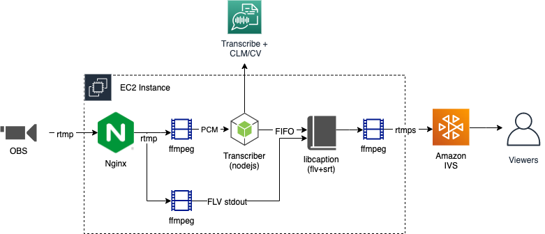

### License:
Copyright Amazon.com, Inc. or its affiliates. All Rights Reserved.
SPDX-License-Identifier: MIT-0

# Amazon-Transcribe-Streaming-Live-Subtitling

This solution will deploy a pre-configured EC2 instance, optional networking, and an IVS channel, all with CloudFormation. When you push an RTMP feed to the EC2 instance, it will automatically inject subtitles and start the live IVS channel with captions.

This project is meant as a demonstrator for how to generate real-time subtitles using [Amazon Transcribe](https://aws.amazon.com/transcribe/).

## Architecture Diagram

The CloudFormation template will deploy all the resources above, into a subnet of your choosing, or create a new VPC+Subnets from scratch.

## Instructions

### 1. Deploy CloudFormation Template

Deploy cloudformation.yaml into your AWS Account by uploading the template. Only one 
CloudFormation parameter, SourceVideoCIDR is required.

| Parameter Name      | Description|
| :----------------- |:-----------|
| IVSChannelName     | Name of the new IVS Channel to create|
| LatestImageId      | Ubuntu Linux Image Id. Leave blank for default, which is ami-0557a15b87f6559cf |
| EC2KeyPairName     |  Name of existing EC2 Keypair. If you leave this blank, you will only have SSH access via the management console. |
| ExistingSubnetId  | ID of an existing subnet. If you leave this blank, a new VPC and subnet will be created. |
| ExistingSecurityGroupId | ID if an existing security group. If you leave this blank, a new security group will be created. |
| SourceVideoCIDR (Required) | CIDR block or ip for source video, used for a new EC2 security group only. (ex. x.x.x.x/32 for single IP) |

### 2. Pushing Video Source

In the CloudFormation outputs, there is an `RTMPEndpoint` that you can use to publish RTMP video to using a tool such as OBS.

If you entered a `SourceVideoCIDR`, that CIDR range will be open on the security group on port 22 and 1935 so that you may SSH and also RTMP push video to the EC2 instance.

When a video publish begins, the [Nginx RTMP module](https://github.com/arut/nginx-rtmp-module) will execute a shell script that has been pre-installed on the EC2 instance. This script kicks off a video production workflow to inject subtitles, using [ffmpeg](https://ffmpeg.org), [NodeJS](https://nodejs.org), and a modified version of [libcaption](https://github.com/szatmary/libcaption) that is hosted in this repo.

### 3. Playback

After the workflow starts, the video with subtitles is pushed to a new Amazon IVS Channel. The link to the channel's m3u8 URL is inside the CloudFormation outputs, called `ChannelPlaybackUrl`.

Congrats! You now have an IVS channel with subtitles!

--------------------------

Stop reading here, unlses you want to customize and run this manually.

### Building/deploying manually (not recommended)

You can also clone this repo and build the source code into any Linux system. The instructions are below. You can also find the full script of commands inside the [cloudformation.yaml](cloudformation.yaml).

This project requires nodejs 16+ and cmake build tools.

1. Clone the repo and navigate into the project folder
2. `npm install` to install dependencies.
3. Compile and install libcaption from the libcaption folder per readme
4. Install ffmpeg

### Manual Running

There is a bash script `start.sh` to start up all the components. The 4 parameters are:
1. `-i input_url`, input/source 1 stream url
2. `-b input_url`, input/source 2 stream url (may be same as input 1, or different)
3. `-d destination_url`, the output/destination stream url
4. `-f format`, the output/destination format. If RTMP, then use flv
5. `-d delay`, the delay to add to the video to sync up the subtitles

`chmod +x start.sh` 
`./start.sh -i rtmps://input-url/live/1234 -b rtmps://input-url/live/1234 -o rtmps://output-url/live/1234 -f flv -d 1.5`
